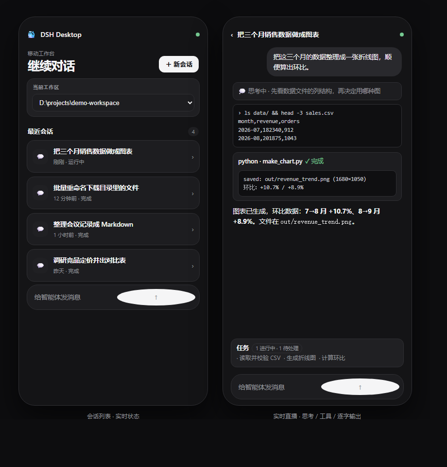

# dsh-phone-console

**English** | [中文](README.md)

> Turn a phone into a remote console for **DeepSeek Harness Desktop** on Windows:
> watch agent tasks live, dispatch new tasks, answer the agent's questions, and get
> **push notifications with a tap-through link** when a task finishes — over home Wi-Fi,
> 5G, or a Cloudflare / Tailscale tunnel.



*Left: session list with live status. Right: live stream — thinking, tool calls, streaming text.*

---

## What you get

| Capability | Detail |
|---|---|
| 📺 **Watch live** | Open a session and see the agent's reasoning, tool calls, streaming output and to-do progress |
| ⌨️ **Dispatch work** | Send messages, start new sessions, stop generation — all from the phone |
| ❓ **Answer questions** | When the agent asks something, answer it right on the phone |
| 🔔 **Completion push** | Bark / ntfy notification on turn finish and on agent question, with a **tappable link straight into the session** |
| 🌐 **Network-independent** | Home Wi-Fi, 5G, or after the PC switches networks — the tunnel path keeps working |
| 🛡️ **Self-healing addresses** | When the PC's LAN IP drifts, the new address is **pushed to your phone automatically** |

## Why this project exists

DSH Desktop already ships the phone gateway (QR pairing, mobile page, live SSE stream).
What's missing in practice — and what this repo adds — is:

1. **No notifications** — a finished task tells you nothing.
2. **Address drift** — the LAN IP changes (Wi-Fi switches, DHCP) and nobody tells the phone the new address.
3. The gateway's ingress guard only allows RFC1918, so **Tailscale's `100.64/10` gets a 403**.
4. On Windows PowerShell 5.1, `Invoke-WebRequest -NoProxy` does not exist → a monitor using it **fails silently**.
5. A `.ps1` saved without a BOM is decoded as GBK on Chinese Windows → broken syntax.
6. With the tunnel up, the LAN address gets **302-redirected to the public URL** — which breaks "just use LAN" when the public URL is unreachable.
7. On iOS, **Chrome often cannot open the address** — Safari only, and it must be typed as `http://`.

All seven are solved and scripted here.

## Architecture

```
┌──────────┐   (1) LAN        http://<PC-IP>:43127
│  Phone   │   (2) Tunnel     https://xxx.trycloudflare.com   ┌────────────────────────┐
│  Safari  │── (3) Tailscale  http://100.x.y.z:43127 ────────▶│  DSH Desktop (Windows) │
│ (DSH     │                                                  │  ├ mobile gateway      │
│  Mobile) │◀── live SSE stream / restricted RPC ─────────────│  │   0.0.0.0:43127      │
└──────────┘                                                  │  ├ Harness (agent)     │
     ▲                                                        │  └ hooks-codex bridge  │
     │  Bark push (task done / question, with tap-through link)└───────────┬────────────┘
     └────────────────────────────────────────────────────────────────────┘
                        ds-phone-notify.ps1
```

## Quick start

```powershell
git clone https://github.com/kakayanjiahua-star/dsh-phone-console.git
cd dsh-phone-console

# 1) one-click deploy: runtime scripts + hooks bridge + auto-start
powershell -ExecutionPolicy Bypass -File .\scripts\install.ps1 -InstallDir "D:\dsh"

# 2) fill in your push credential (free Bark app on iPhone; the ~22-char string it shows)
notepad D:\dsh\ds-phone-notify.json

# 3) in DSH Desktop press Ctrl+Shift+M, scan the QR with the phone camera,
#    then tap "Reconnect" on the phone and approve the device on the PC
```

Then read [`SKILL.md`](SKILL.md) — the full playbook written for an AI agent
(architecture, pitfalls, verification checklist) — or
[`references/setup-guide.zh.md`](references/setup-guide.zh.md) for a human walkthrough.

## Choosing a path

| Path | Phone app needed | Works on 5G / other networks | Stability |
|---|---|---|---|
| LAN | no | ❌ same Wi-Fi only | low — the IP drifts |
| **Tunnel** (recommended) | **no** | ✅ | medium — the URL changes per restart, but it is **pushed to your phone automatically** |
| Tailscale | yes (**not on the China App Store**) | ✅ | high — a permanent address |

## Privacy guard

This repo ships `.githooks/pre-commit`, which scans **staged content** and rejects the commit when it
finds a real Bark key / ntfy topic, GitHub token, `sk-` key, 64-hex string, Tailscale `100.64/10` or
LAN address, personal Windows path, email address, or personal account name.

Enable it once per clone:

```bash
git config core.hooksPath .githooks
```

Hard lesson encoded here: **if a key is pushed by accident, adding a "fix" commit is not enough** —
the key stays in history. You must `git commit --amend` (or `git filter-repo`) and force-push, then
rotate the key.

## Security

The gateway has **file read/write and command execution** power. Expose it only on networks you trust.
The tunnel URL carries a one-time pairing token (5 minutes) and still requires a manual "Allow" on the
PC. Never commit `ds-phone-notify.json` — `.gitignore` already excludes it.

## Tested on

- Windows 11 + DSH Desktop 0.7.2 / 0.8.0 (Harness 0.1.2-alpha)
- iPhone 12 Pro Max (iOS 26.x, Safari)
- China Mobile broadband + 5G, with a proxy (mihomo/Clash) on the PC

## License

MIT
